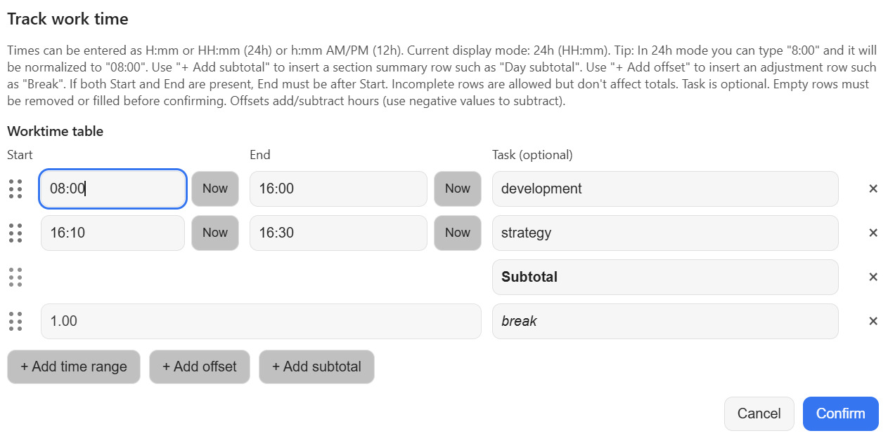
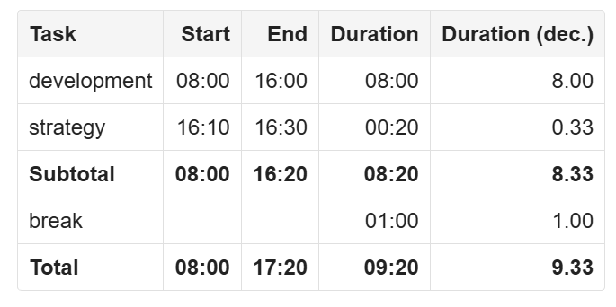

# siyuan-worktime-table
A SiYuan plugin for creating and editing worktime tables directly in your notes or daily notes. It helps you record work sessions, calculate total working time, and apply manual offsets such as breaks or corrections.

Sibling of [logseq-worktime-table](https://github.com/wiegi/logseq-worktime-table). Both plugins share the same calculation core.

The dialog produces a regular SiYuan table:

## Features
* Create worktime tables from the slash menu
* Record multiple entries with task, start time, end time, and duration
* Automatically calculate totals across all completed rows
* Insert subtotal rows for section-level summaries inside a table
* Add positive or negative offsets for breaks or manual adjustments
* Reopen and edit existing tables from the block menu
* Optional 12-hour clock display with AM/PM selection
* Export tables as CSV files
* Works in the desktop app and in the browser version of SiYuan

The result is a regular SiYuan table block, so it can be searched, referenced and styled like any other table.

## Usage
### Create a table
1. Type `/worktime` in an empty block
2. Choose **Worktime Table: Create table**
3. Fill in one or more rows
4. Add subtotals and offsets if needed
5. Confirm to insert the table (it replaces the empty block, or is inserted below a block that already has text)

### Edit a table
1. Click the block handle (the six dots) of the table block
2. Choose **Worktime Table: Edit table**
3. Update the values in the dialog
4. Confirm to replace the table in place

### Export as CSV
1. Click the block handle of the table block
2. Choose **Worktime Table: Export as CSV**
3. The file is downloaded as `worktime-table_<document title>.csv`

The dialog can be closed with **Cancel**, `Esc`, or a click outside of it.

## How it works
Each table contains one or more work rows. A row can include:
* a task name
* a start time
* an end time

The plugin calculates:
* the duration of each completed row
* the earliest visible start time
* the summed total duration

By default, the **Total** row shows:
* **Start** = earliest visible start time
* **End** = derived end time calculated as earliest visible start plus total summed duration

If you do not want these values, enable **Disable Start/End in Total row** in the plugin settings so the Total row only shows duration totals.
Subtotal rows can be inserted anywhere in the table. Each subtotal row sums the relevant rows above it since the previous subtotal row, while the final **Total** row still sums the whole table.
Only rows with both **Start** and **End** values are included in the calculations.

### Time input
* Enter one or more time ranges
* Add subtotal rows to group related work entries
* Add an optional task name for each row
* All valid rows are summed into **Total Duration**
* Both 24-hour and 12-hour input are supported, depending on your settings and entered format

### Offsets
Offsets let you adjust the total duration manually. Common use cases:
* subtract break time
* add credited time
* apply manual corrections

Examples:
* `-0.5` = subtract 30 minutes
* `1.25` = add 1 hour 15 minutes

Positive offsets increase the total duration. Negative offsets reduce it.

## Settings
Open `Settings → Marketplace → Downloaded → Plugins → Worktime Table → Settings`, then confirm to save.

### Use 12-hour clock (AM/PM)
When enabled:
* the dialog displays times in 12-hour format
* AM/PM selectors are shown

The plugin still accepts:
* 24-hour input such as `14:30`
* 12-hour input such as `2:30 PM`

### Disable Start/End in Total row
When enabled:
* the **Total** row leaves Start and End empty
* subtotal rows also leave Start and End empty
* only the duration totals are shown

When disabled:
* the **Total** row shows a Start and End value
* **Start** is the earliest visible start time in the table
* **End** is a derived value: earliest start plus total summed duration

## Installation
The plugin is not in the SiYuan marketplace yet. To install it manually:

1. Build it: `npm install && npm run build`
2. Copy the contents of `dist/` to `<workspace>/data/plugins/siyuan-worktime-table/` (a real folder, not a link)
3. Reload SiYuan (`Ctrl+R`) and enable the plugin under `Settings → Marketplace → Downloaded → Plugins`

For a self-hosted SiYuan (e.g. Docker), put the folder into the workspace of the server instance. The plugin then works in every browser that connects to it.

## Development
* `npm test` runs the unit tests for the shared core and the SiYuan markdown handling
* `npm run typecheck` checks the types
* `npm run dev` rebuilds `dist/` on every change; copy it to the plugin folder and reload SiYuan to try it

`src/core/` is shared logic from the Logseq plugin (time parsing, table build/parse, CSV). `src/modal.ts` is the dialog, `src/index.ts` the SiYuan integration.

## Known limitations
* Tables are rewritten as plain SiYuan table blocks; there is no inline "Edit" button, use the block menu instead
* English UI only for now

## Support
If you like this plugin, you can support me here:

